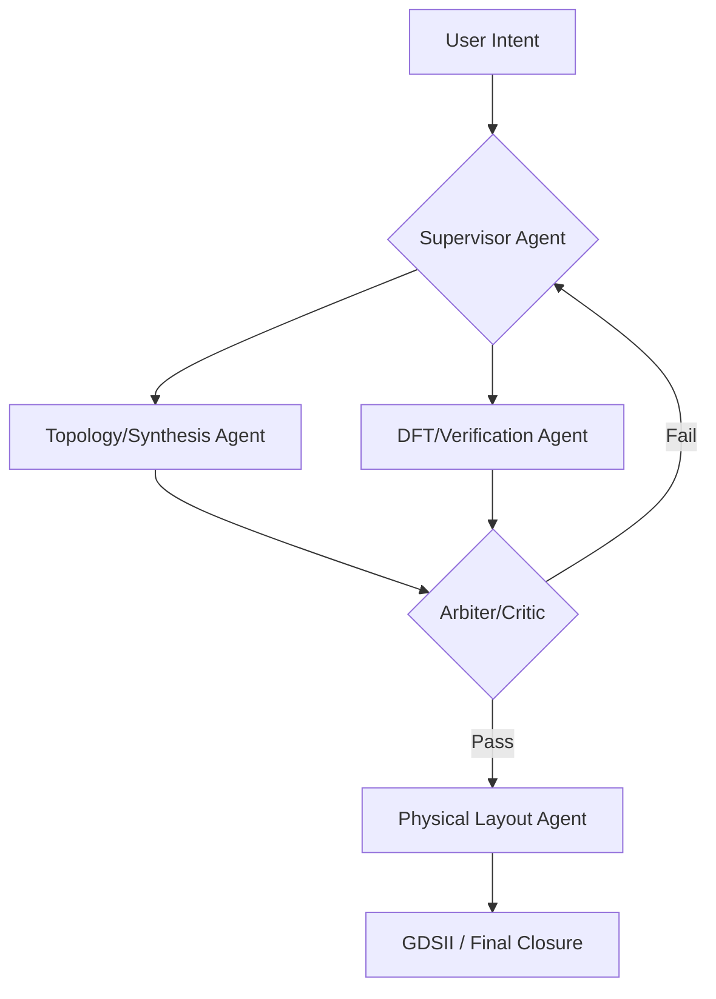

# 1. Core Agentic Architectures and Mechanisms 🏗️

**TL;DR:** Production-grade agentic systems require explicit control over reasoning paths. Unlike early "black box" autonomous agents, 2026-standard systems utilize **Agentic Workflows** modeled as stateful graphs.

---

## 🔑 Key MAS Design Patterns

### 1. Supervisor-Worker Pattern
A central orchestrator (e.g., GPT-5.2 or Claude 4.5) decomposes a high-level intent (e.g., *"Implement a low-power RISC-V core"*) into sub-tasks and dispatches them to specialized workers (Synthesis Agent, DFT Agent).

### 2. Consensus-Based Reasoning
Multiple agents (e.g., divergent thought agents) propose different design topologies. A **decision-making agent acts as an arbiter**, selecting the optimal proposal based on PPA (Power, Performance, Area) metrics.

### 3. Handoff Pattern
Control flows dynamically between specialists. For instance, if a "Sizing Agent" fails to meet gain requirements, it hands the state back to the "Topology Selection Agent" with specific error context.

### 4. Stateful Graph Workflows
Utilizing frameworks like **LangGraph**, design flows are mapped as Directed Acyclic Graphs (DAGs) or cyclic loops, allowing agents to iteratively refine netlists based on simulator feedback.

---

## 🕸️ The Architecture Graph

Here is the fundamental stateful graph of a production-grade 2026 MAS:

**Next:** Dive into how specific models implement these architectures in [Section 2: Deep Dive SOTA AI EDA Solutions](./02_Deep_Dive_SOTA_EDA.md).