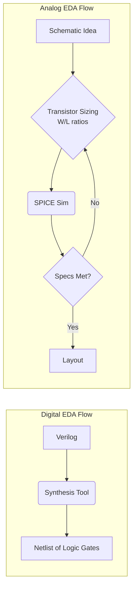

# Module 2: The Analog EDA Challenge ⚡

**TL;DR:** Digital design is like snapping together Legos. Analog design is like baking a soufflé while blindfolded on a rollercoaster. AI struggles with Analog because it's continuous, highly coupled, and obsessed with layout geometry.

---

## 🧱 Digital vs. 🎂 Analog

Why can an AI design a whole CPU in a day, but takes weeks to design a single Op-Amp?

### 1. **Discrete vs. Continuous**
- **Digital:** A signal is either `0` or `1`. There is huge noise margin.
- **Analog:** A signal is `1.234V`. If a parasitic capacitor pulls it down to `1.220V`, the entire circuit might fail. It's a spectrum, not a binary.

### 2. **Synthesis vs. Sizing**
- **Digital:** You write RTL code (Verilog). A tool (Yosys) automatically picks standard cells from a library and connects them.
- **Analog:** You don't have standard cells. You pick individual transistors (NMOS/PMOS) and have to decide their exact Width ($W$) and Length ($L$) down to the nanometer.

---

## 🕷️ The 3 Bottlenecks for AI in Analog

Why do LLMs fail when you ask them to "design a high-gain Op-Amp"?

### 1. The Dimensionality Explosion
An LLM doesn't "know" physics natively. If you have an Op-Amp with 10 transistors, each has a Width ($W$) and Length ($L$) parameter. That's 20 parameters to tune.

Even if you just allow 10 possible sizes for each parameter, the search space is $10^{20}$ combinations. **Brute force doesn't work.**

### 2. The Black Magic of Layout & LDEs
In digital, if wire A crosses wire B, you just use a different metal layer.

In analog, the physical layout dictates everything. To an LLM, the netlist looks identical, but the layout introduces:
1. **Parasitic R, L, and C:** Coupling capacitance injecting noise into sensitive nodes.
2. **Layout Dependent Effects (LDEs):** In deep sub-micron nodes (FinFET/FD-SOI), exactly *where* a transistor sits relative to the N-Well edge (Well Proximity Effect) or Shallow Trench Isolation (STI Stress) literally changes its threshold voltage ($V_{th}$).
3. **Mismatch Variations (Pelgrom's Law):** You must draw transistors with Common-Centroid geometry, otherwise process gradients across the die will ruin the differential pair matching $\sigma(\Delta V_{th}) \propto \frac{1}{\sqrt{WL}}$. An LLM cannot "see" a common-centroid layout naturally.

<svg width="600" height="200" xmlns="http://www.w3.org/2000/svg">
    <!-- Schematic representation -->
    <text x="50" y="30" font-family="Arial" font-size="16" font-weight="bold">Netlist View (What AI Sees)</text>
    <line x1="50" y1="100" x2="200" y2="100" stroke="black" stroke-width="4"/>
    <line x1="50" y1="150" x2="200" y2="150" stroke="black" stroke-width="4"/>
    <text x="220" y="105" font-family="Arial" font-size="14">Signal A</text>
    <text x="220" y="155" font-family="Arial" font-size="14">Signal B</text>

    <!-- Layout representation -->
    <text x="350" y="30" font-family="Arial" font-size="16" font-weight="bold" fill="red">Layout View (Reality)</text>
    <rect x="350" y="80" width="150" height="20" fill="#3498db" />
    <rect x="350" y="120" width="150" height="20" fill="#e74c3c" />

    <!-- Parasitic Capacitor -->
    <line x1="425" y1="100" x2="425" y2="110" stroke="black" stroke-width="2"/>
    <line x1="400" y1="110" x2="450" y2="110" stroke="black" stroke-width="3"/>
    <line x1="400" y1="115" x2="450" y2="115" stroke="black" stroke-width="3"/>
    <line x1="425" y1="115" x2="425" y2="120" stroke="black" stroke-width="2"/>

    <text x="470" y="117" font-family="Arial" font-size="12" fill="red">Parasitic Cap ($C_p$)</text>
</svg>

### 3. Conflicting Constraints (The Pareto Front)
In Analog design, you can't have it all.
- You want more **Gain**? You sacrifice **Bandwidth**.
- You want lower **Noise**? You sacrifice **Power Consumption**.

An agent needs to understand how to navigate these trade-offs, often relying on complex optimization algorithms (like Bayesian Optimization or Genetic Algorithms) *guided* by the LLM, rather than the LLM just guessing.

---

## 🛠️ How we fix it: Agentic AI
We don't ask the LLM to guess the transistor sizes. We build an **Agentic System**:
1. The **LLM** acts as the high-level Planner.
2. It uses an **Optimizer Tool** (Python script) to find the exact W/L values.
3. It uses a **Simulator Tool** (ngspice) to test the values.
4. It reads the results and decides what to do next.

👉 **Next Step:** Let's look at the Architecture of this multi-agent system in [Module 3](./03_Multi_Agent_Architecture.md).