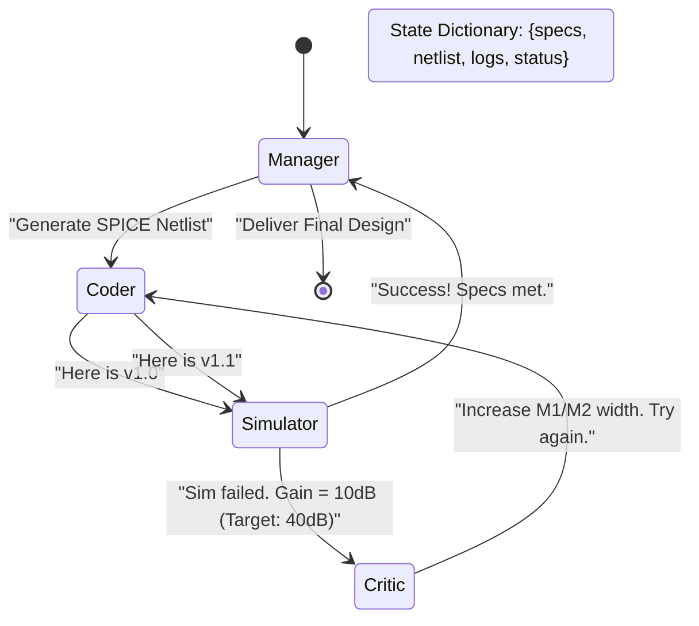

# Module 3: SOTA Multi-Agent Architecture for Analog 🤖

**TL;DR:** One AI agent gets confused easily. To build a Production-Grade Analog EDA system, we need a **Multi-Agent System** where different agents have specific jobs (Manager, Coder, Simulator, Critic). We use a framework like **LangGraph** to connect them in a cyclical, state-passing workflow.

---

## 🏗️ Why Multi-Agent?

Think of a real hardware design team:
1. **The System Architect (Manager):** Reads the spec sheet and divides the work.
2. **The Layout Engineer (Coder):** Draws the transistors and routes the wires.
3. **The Verification Engineer (Simulator):** Runs the testbench and finds bugs.
4. **The Senior Engineer (Critic):** Looks at the bugs and tells the Layout Engineer *why* they failed.

If you give all these jobs to one LLM in a single chat prompt, it hallucinates. Multi-agent systems give each LLM a strict role, strict tools, and a strict communication path.

---

## 🕸️ The LangGraph Workflow

**LangGraph** is a framework that allows you to build cyclic graphs for LLMs. Instead of a simple straight line (Prompt $\rightarrow$ Output), the agents can loop around, pass a "State" dictionary between each other, and iterate until the design works.

Here is the SOTA architecture for Analog EDA:



### 🧑‍💼 The Agents in Detail

| Agent Role | Job Description | Primary Tools |
| :--- | :--- | :--- |
| **Manager (Planner)** | Reads user intent. Breaks it down into sub-tasks. Monitors progress. | `task_queue`, `done_checker` |
| **Coder (Executor)** | Writes SPICE netlists, Python automation scripts, or Magic layout commands. | `file_writer`, `regex_parser` |
| **Simulator (Tool Node)**| *Not an LLM.* This is a Python script that runs `ngspice` or `KLayout` and returns the raw logs/waveforms. | `subprocess.run('ngspice')` |
| **Critic (Reviewer)** | Reads the Simulator logs. Compares the output to the target specs. Provides exact instructions on how to fix it. | `log_parser`, `spec_comparator` |

### The Reflection State (Self-Consistency)
Before the Critic sends feedback to the Coder, SOTA architectures employ a **Reflection Node**. The agent asks itself: *"Did my previous 5 attempts move the Gain closer to the target, or further away?"* If the gradient is negative, the agent prunes that branch of thought and reverts to the best-known state. This prevents infinite divergent loops.

---

## 🧠 Memory and State Management

In LangGraph, agents communicate by modifying a shared **State**. This is crucial for Analog EDA because you need to track the history of your tuning.

If the agent tries $W = 10\mu m$ and it fails, it needs to remember that so it doesn't try it again 10 iterations later.

### Token Pruning for Long Simulations
Analog optimization loops might run 50+ times. Passing 50 simulation logs back to the LLM will exhaust the 128k context window and degrade reasoning (the "Lost in the Middle" phenomenon). Production systems use a `MemoryManager` tool that compresses past iterations into an array of floats: `[Attempt 1: W=1u, G=10dB]`, rather than storing the raw text log.

```python
# Example of the Shared State in LangGraph
class AnalogDesignState(TypedDict):
    target_specs: dict      # e.g., {"gain": ">40dB", "pm": ">60deg"}
    current_netlist: str    # The SPICE code
    simulation_logs: str    # Raw output from ngspice
    history: list           # List of previous attempts
    status: str             # "coding", "simulating", "reviewing", "done"
```

---

## 🔮 Interactive Visualization

To truly understand how state passes through the LangGraph nodes during an Analog design loop, please open the interactive visualization:

👉 **[Open Interactive LangGraph Visualization](./visualizations/agent_flow.html)** *(Requires opening the raw HTML file in a web browser)*

---

👉 **Next Step:** Enough theory. Let's actually build this in Python. Go to [Module 4: Agentic SPICE Simulation](./notebooks/04_HandsOn_Agentic_Ngspice.ipynb).