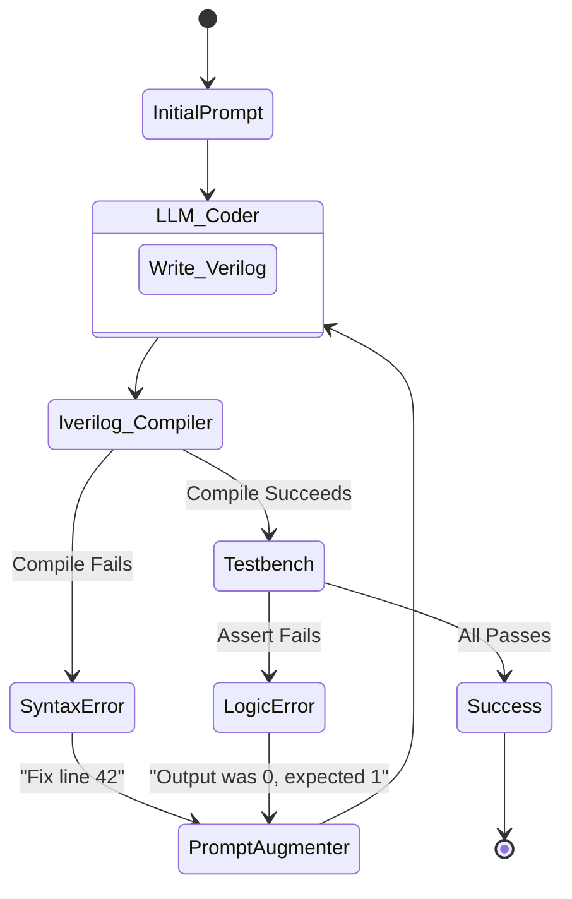
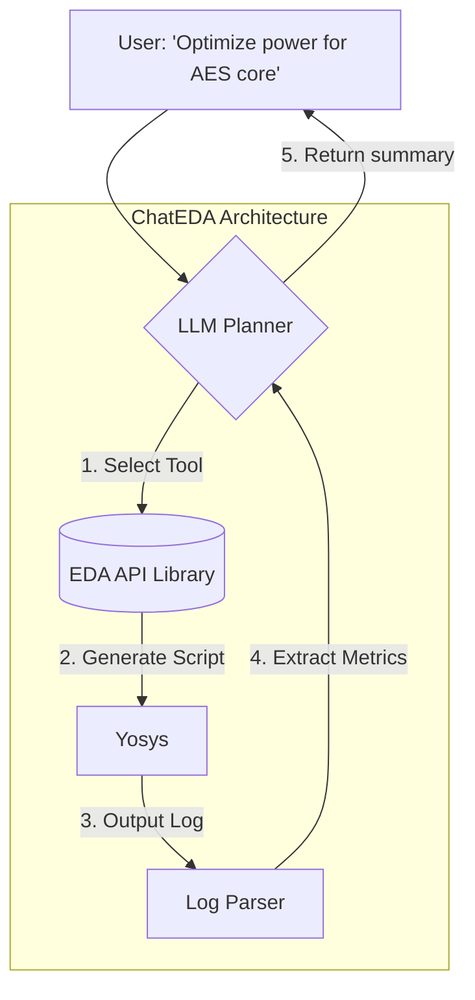

# Module 6: Extensive Deep Dive on Existing Agentic EDA Architectures 🔬

**TL;DR:** To build the future, we have to study the giants that came before us. This module is an extensive teardown of current SOTA (State of the Art) AI-EDA frameworks: **AutoChip**, **ChatEDA**, **ChipNeMo**, and others. We'll look at *exactly* how their agents think, how they use tools, and what makes them successful.

---

## 1. AutoChip: The Iterative Verilog Master 🛠️

**Goal:** Generate flawless, compile-ready Verilog from natural language.

**The Problem it Solved:** Early LLMs generated Verilog that looked good but failed synthesis due to syntax errors. AutoChip introduced the "Compiler-in-the-Loop" concept.

### 🧠 How the Agent Works:
AutoChip isn't a single prompt; it's a closed feedback loop.

1. The LLM generates the Verilog.
2. The agent automatically writes a testbench (or uses a provided one).
3. The agent compiles it using Icarus Verilog (`iverilog`).
4. **The Magic:** If it fails, AutoChip parses the compiler error, appends it to the prompt history, and forces the LLM to rewrite it.

**Key Takeaway for Analog:** This strict, iterative loop is exactly what we replicate in Analog EDA using SPICE (`ngspice`) instead of `iverilog`.

### 📚 Deeper Dive: The AST Limitation
AutoChip relies heavily on raw string matching. If a user asks for a modification, the LLM rewrites the string from scratch. State-of-the-art extensions now parse the code into an **Abstract Syntax Tree (AST)** before feeding it back to the agent. This allows the agent to surgically patch one node (e.g., a specific flip-flop definition) rather than hallucinating new errors in previously working code during a complete rewrite.

---

## 2. ChatEDA: The Autonomous Tool Orchestrator 🤖

**Goal:** Replace TCL scripting with natural language for physical design (synthesis, placement, routing).

**The Problem it Solved:** Tools like OpenROAD and Yosys have massive learning curves. ChatEDA uses an agent to map a human intent ("Route the design") into strict TCL commands.

### 🧠 How the Agent Works:
ChatEDA uses a fine-tuned model called **AutoMage**. It acts as a Task Planner and Executor.

1. **Task Planning:** User says "Synthesize and run DRC." The agent splits this into two nodes: `[Run Yosys]` $\rightarrow$ `[Run Magic]`.
2. **Tool-Use (API):** ChatEDA gives the LLM access to a library of EDA scripts. The LLM doesn't write TCL from scratch; it fills in the parameters of existing API calls.
3. **Execution & Log Parsing:** It runs the tool, reads the `.log` file, and summarizes the area/power metrics back to the user.

**Key Takeaway for Analog:** Don't ask the LLM to invent open-source commands from scratch. Give the LLM a library of predefined, verified Python/TCL wrappers to call.

### 📚 Deeper Dive: Instruction Fine-Tuning & LoRA
To create **AutoMage**, researchers didn't train a model from scratch. They took an existing open-source model (like Llama-2) and performed **Instruction Fine-Tuning** using a technique called **LoRA (Low-Rank Adaptation)**. They fed it thousands of `<Instruction, TCL_Command>` pairs scraped from GitHub EDA scripts. LoRA is crucial because it only updates a tiny fraction of the neural network weights, meaning a PhD student with a single consumer GPU (e.g., RTX 4090) can train an EDA model without spending millions on compute.

---

## 3. ChipNeMo: Domain-Adapted Foundation Models 🧠

**Goal:** An LLM that actually understands hardware, built by NVIDIA.

**The Problem it Solved:** General models like GPT-4 are trained on Reddit and Wikipedia. ChipNeMo is trained on internal bug reports, proprietary hardware documentation, and EDA scripts.

### 🧠 How the Agent Works:
ChipNeMo isn't an execution agent (like ChatEDA); it's an **Engineering Assistant**. It excels at:
1. **EDA Script Generation:** Generating complex, obscure tool scripts that aren't on GitHub.
2. **Bug Triage:** Reading a massive log file and pinpointing the exact failure cause.
3. **RAG (Retrieval-Augmented Generation):** It uses RAG to pull from thousands of pages of PDF specification manuals to answer questions.

**Key Takeaway for Analog:** To make a truly SOTA Analog agent, you cannot rely purely on prompt engineering. You must use **RAG**. If an agent is designing an Op-Amp, it should have a vector database of successful Op-Amp designs to reference before it writes the netlist.

---

## 4. Comparing the Architectures: What do we steal for Analog?

To build our ultimate Analog Multi-Agent System (as seen in Module 3), we combine the best of these frameworks:

| Framework | Best Feature | How we use it in Analog EDA |
| :--- | :--- | :--- |
| **AutoChip** | Compiler-in-the-loop | "Simulator-in-the-loop". We use ngspice to prove the LLM wrong and force iterations. |
| **ChatEDA** | API abstraction | We don't ask the LLM to write raw Magic TCL. We give it high-level Python functions (`place_transistor(W, L, x, y)`). |
| **ChipNeMo** | Domain RAG | Before the agent sizes a circuit, we give it RAG access to textbook examples of sizing trade-offs (e.g., gain vs. bandwidth). |

👉 **Next Step:** Now that we know what the big players are doing, let's have a realistic talk about what *actually* works and what is just hype in [Module 7](./07_Realistic_Assessment.md).